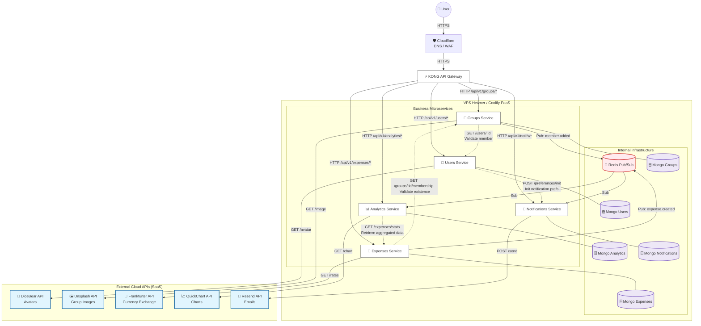

```mermaid
graph TD

%% ========================================
%% LAYER 1 – USER & EDGE
%% ========================================

User((👤 User))
Cloudflare[🛡️ Cloudflare <br> DNS / WAF]
Gateway[⚡ KONG API Gateway]

User -->|HTTPS| Cloudflare
Cloudflare -->|HTTPS| Gateway

%% ========================================
%% LAYER 2 – INTERNAL MICROSERVICES
%% ========================================

subgraph "VPS Hetzner / Coolify PaaS"
  direction TB

  subgraph Core["Business Microservices"]
    Users[👤 Users Service]
    Groups[👥 Groups Service]
    Expenses[💸 Expenses Service]
    Analytics[📊 Analytics Service]
    Notifs[🔔 Notifications Service]
  end

  subgraph Infra["Internal Infrastructure"]
    Redis[(🔴 Redis Pub/Sub)]
    MongoUsers[(🗄️ Mongo Users)]
    MongoGroups[(🗄️ Mongo Groups)]
    MongoExpenses[(🗄️ Mongo Expenses)]
    MongoAnalytics[(🗄️ Mongo Analytics)]
    MongoNotifs[(🗄️ Mongo Notifications)]
  end
end

%% ========================================
%% NORTH–SOUTH FLOW (GATEWAY ROUTING)
%% ========================================

Gateway -->|HTTP /api/v1/users/*| Users
Gateway -->|HTTP /api/v1/groups/*| Groups
Gateway -->|HTTP /api/v1/expenses/*| Expenses
Gateway -->|HTTP /api/v1/analytics/*| Analytics
Gateway -->|HTTP /api/v1/notifs/*| Notifs

%% ========================================
%% EAST–WEST COMMUNICATION (INTERNAL HTTP)
%% ========================================

Groups -.->|GET /users/:id <br> Validate member| Users
Expenses -.->|GET /groups/:id/membership <br> Validate existence| Groups
Analytics -.->|GET /expenses/stats <br> Retrieve aggregated data| Expenses
Users -.->|POST /preferences/init <br> Init notification prefs| Notifs

%% ========================================
%% ASYNCHRONOUS COMMUNICATION (REDIS PUB/SUB)
%% ========================================

Expenses --Pub: expense.created--> Redis
Groups --Pub: member.added--> Redis
Redis --Sub--> Notifs
Redis --Sub--> Analytics

%% ========================================
%% PERSISTENCE LAYER
%% ========================================

Users --- MongoUsers
Groups --- MongoGroups
Expenses --- MongoExpenses
Analytics --- MongoAnalytics
Notifs --- MongoNotifs

%% ========================================
%% LAYER 3 – SAAS EXTERNAL INTEGRATIONS
%% ========================================

subgraph "External Cloud APIs (SaaS)"
  DiceBear[🎨 DiceBear API <br> Avatars]
  Unsplash[🖼️ Unsplash API <br> Group Images]
  Forex[💱 Frankfurter API <br> Currency Exchange]
  QuickChart[📈 QuickChart API <br> Charts]
  Resend[📧 Resend API <br> Emails]
end

Users -->|GET /avatar| DiceBear
Groups -->|GET /image| Unsplash
Expenses -->|GET /rates| Forex
Analytics -->|GET /chart| QuickChart
Notifs -->|POST /send| Resend

%% ========================================
%% STYLING
%% ========================================

classDef svc fill:#ffffff,stroke:#444,stroke-width:1px;
classDef external fill:#e1f5fe,stroke:#01579b,stroke-width:2px;
classDef infra fill:#fff3e0,stroke:#ef6c00,stroke-width:2px;
classDef database fill:#ede7f6,stroke:#5e35b1,stroke-width:1.5px;
classDef redis fill:#ffebee,stroke:#d32f2f,stroke-width:2px;
class Gateway svc
class Users,Groups,Expenses,Analytics,Notifs svc
class DiceBear,Unsplash,Forex,QuickChart,Resend external
class Redis redis
class MongoUsers,MongoGroups,MongoExpenses,MongoAnalytics,MongoNotifs database
```